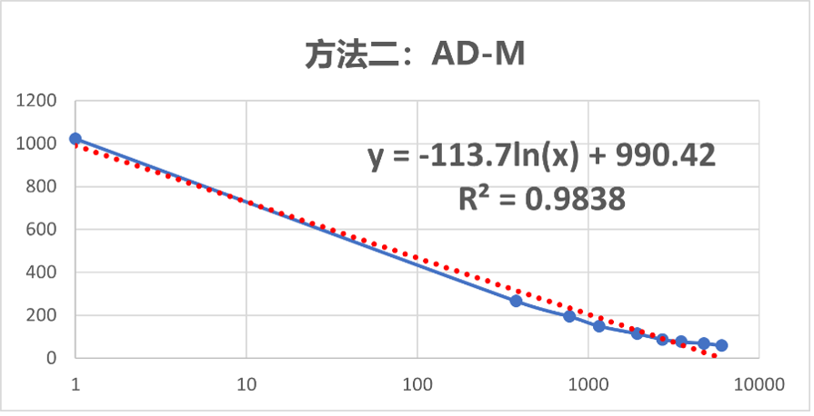

# 薄膜柔性压力传感器压力测量

## **概述：**

传感器型号为RP-C18.3-LT，其工作原理是阻值随着作用于感应区上的压力增大而减小。目前该类型传感器在标定方面相关资料较少，并且由于使用场景不同，直接使用官方手册给出的压力阻值曲线图不能取得较好的效果，故在此给出一种标定方法，实际测试下精度尚可，在传感器量程区间可达到较高测量精度。本方法对其他同类型的薄膜压力传感器也同样适用。

视频演示：https://www.bilibili.com/video/BV1GR4y1J74R?spm_id_from=333.999.0.0

## 驱动方式

**驱动方式：** 压力传感器 → 线性电压放大器 → Arduino → USB串口/LCD1602

## 标定流程

**标定原理：** 由传感器手册可知，传感器在受压时阻值发生变化会产生一定规律的变化，故变化规律函数可通过试验+数据拟合得出。下文中AD值为arduino A0引脚作为模拟量输入端口，采集到压力传感器经线性电压放大器放大后的数值，范围为0-1023（PS: 若使用位数更高的采集设备，可获得更高的测量精度）

**准备工作：** 在传感器量程范围内，取**已知质量**的重物放置在传感器上读取对应的AD值并记录，以RP-C18.3-L为例，取9组数据并计算1/AD值，数据如图所示。

#### 方法一：计算压力值F与1/AD值的关系函数

- 取1/AD为X轴，M为Y轴，在EXCEL中绘制散点图，并添加趋势线。
- 选择多项式，并勾选下方“显示公式”与“显示R平方值”，趋势线R²≥0.95视为可用。
- 该趋势线函数为1/AD与质量M关系函数，将Arduino采集到的AD值代入该式即可计算出压力值。

#### 方法二：计算压力值F与AD值的关系函数

- 取AD为X轴，M为Y轴，在EXCEL中绘制散点图，横坐标轴设置为“对数”并添加趋势线。

- 选择多项式，并勾选下方“显示公式”与“显示R平方值”，趋势线R²≥0.95视为可用。

- 该趋势线函数为质量M与AD关系函数，还要将其转换为以AD为自变量的函数。
  $$
  x=e^\frac{y-990.4}{-113.7}
  $$

- 将Arduino采集到的AD值代入该式即可计算出压力值，示例程序中为计算方便将该函数转换为了以10底的指数函数，实际使用时何种形式都可。

## 备注

- 建议提前估算测量的压力值范围，在预计测量范围内测量10组以上数据保证数据拟合精度，取的组数越多后期测量确度越高。
- 标定示例的excel文档可进一步进行参考。
